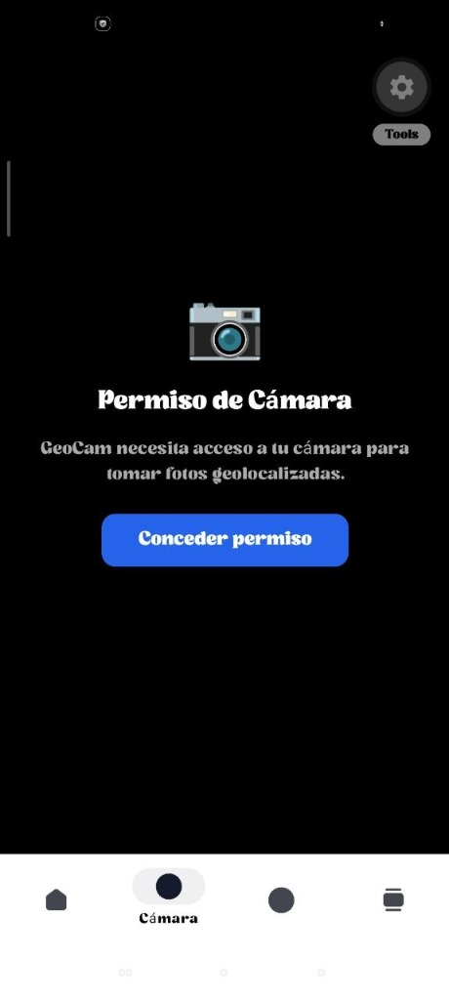
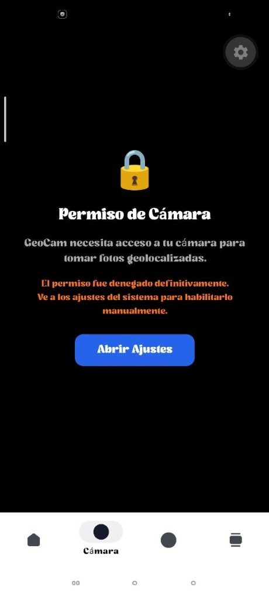
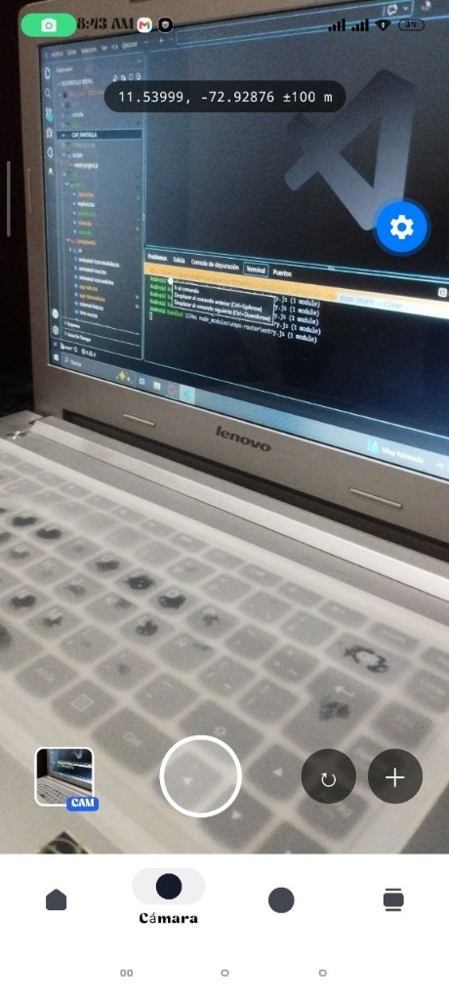
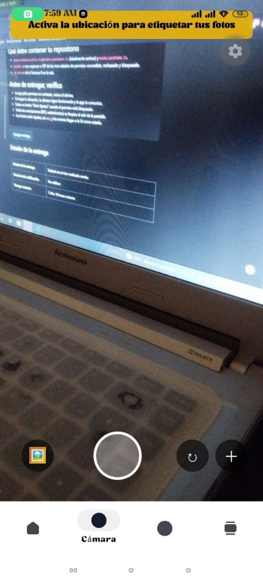
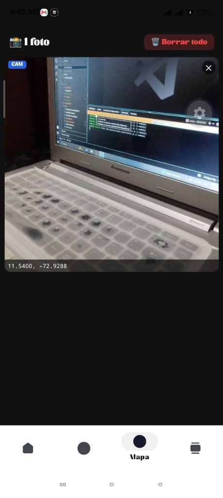
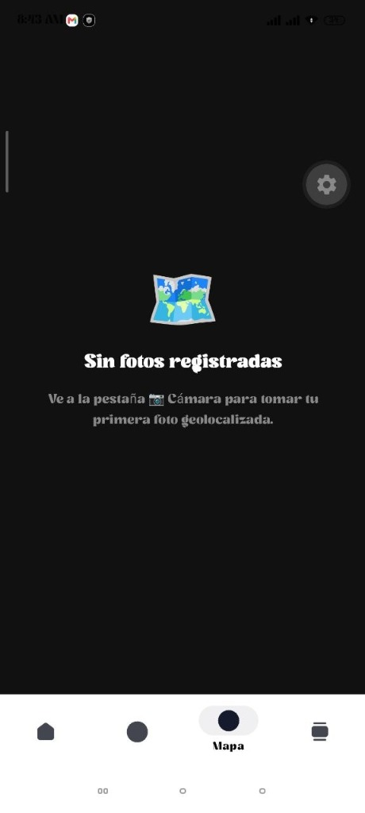
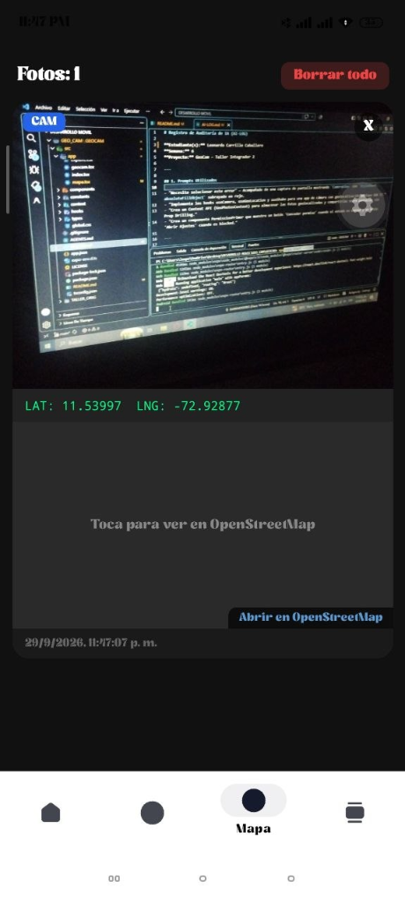
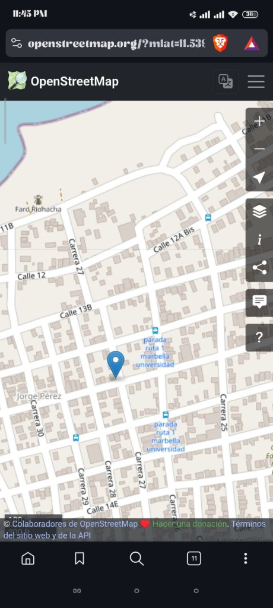

# 📸 GeoCam

Aplicación móvil desarrollada con **React Native + Expo SDK 57** que permite tomar fotografías geolocalizadas, importar imágenes desde la galería y visualizarlas en una galería con coordenadas GPS.

---

## 🎯 Características principales

- **Cámara con geolocalización** — Toma fotos que se etiquetan automáticamente con tus coordenadas GPS en tiempo real.
- **Importar desde galería** — Selecciona imágenes existentes y se les asigna tu ubicación actual.
- **Galería de fotos** — Visualiza todas las fotos capturadas con sus coordenadas, fuente (CAM/GAL) y opción de eliminar.
- **Permisos en contexto** — La app solicita permisos de cámara y ubicación de forma progresiva, nunca al abrirse.
- **Degradación elegante** — Si se niega el GPS, la cámara sigue funcionando y la app lo comunica al usuario.
- **Detección de shake** — Al agitar el teléfono, se ofrece borrar todas las fotos registradas.
- **Botón "Abrir Ajustes"** — Si un permiso es bloqueado definitivamente, se muestra un botón para ir a los ajustes del sistema.

---

## 📱 Capturas de pantalla

### 🔐 Los 3 estados de permiso: Concedido, Rechazado y Bloqueado

<table>
  <tr>
    <td align="center" width="33%">
      <br/>
      <b>❌ Rechazado (Denied)</b><br/>
      <sub>La app pide el permiso en contexto con un botón "Conceder permiso". No se solicita automáticamente al abrirse.</sub>
    </td>
    <td align="center" width="33%">
      <br/>
      <b>🔒 Bloqueado (Blocked)</b><br/>
      <sub>Si el usuario denegó permanentemente, aparece el botón "Abrir Ajustes" para ir a la configuración del sistema.</sub>
    </td>
    <td align="center" width="33%">
      <br/>
      <b>✅ Concedido (Granted)</b><br/>
      <sub>Cámara funcionando con coordenadas GPS en tiempo real. Badge "CAM" en la miniatura de la última foto.</sub>
    </td>
  </tr>
</table>

### 📷 Funcionalidades de la app

<table>
  <tr>
    <td align="center" width="20%">
      <br/>
      <b>Cámara sin GPS</b><br/>
      <sub>Banner para activar ubicación.</sub>
    </td>
    <td align="center" width="20%">
      <br/>
      <b>Galería con fotos</b><br/>
      <sub>Fotos capturadas con badge (CAM/GAL).</sub>
    </td>
    <td align="center" width="20%">
      <br/>
      <b>Mapa vacío</b><br/>
      <sub>"Sin fotos registradas".</sub>
    </td>
    <td align="center" width="20%">
      <br/>
      <b>Mini-Mapa Integrado</b><br/>
      <sub>Mini-mapa estático debajo de la foto.</sub>
    </td>
    <td align="center" width="20%">
      <br/>
      <b>OpenStreetMap</b><br/>
      <sub>Abre la ubicación en el navegador.</sub>
    </td>
  </tr>
</table>

---

## 🛠️ Tecnologías utilizadas

| Tecnología | Uso |
|---|---|
| **React Native 0.86** | Framework de desarrollo móvil |
| **Expo SDK 57** | Plataforma de desarrollo y build |
| **Expo Router** | Navegación basada en archivos |
| **expo-camera** | Acceso a la cámara del dispositivo |
| **expo-location** | Geolocalización (GPS) |
| **expo-image-picker** | Selección de imágenes de galería |
| **expo-sensors** | Acelerómetro (detección de shake) |
| **TypeScript** | Tipado estricto sin `any` |

---

## 📁 Estructura del proyecto

```
src/
├── app/
│   ├── _layout.tsx          # Layout raíz con GeoPhotosProvider
│   ├── index.tsx            # Redirect automático a /geocam
│   ├── geocam.tsx           # Pantalla de cámara principal
│   ├── mapa.tsx             # Galería de fotos con coordenadas
│   └── explore.tsx          # Pantalla de exploración
├── components/
│   ├── PermissionPrimer.tsx # UI para solicitar permisos
│   ├── app-tabs.tsx         # Navegación por pestañas (nativo)
│   └── app-tabs.web.tsx     # Navegación por pestañas (web)
├── context/
│   └── GeoPhotosContext.tsx # Estado global de fotos (Context API)
├── hooks/
│   ├── useCamera.ts         # Hook: permisos, captura, flip cámara
│   ├── useGeoLocation.ts    # Hook: GPS en tiempo real + cleanup
│   └── useShake.ts          # Hook: detección de shake + cleanup
└── types/
    └── geo.ts               # Tipos: Coords, GeoPhoto, PermissionState
```

---

## 🧪 Hooks implementados

### `useCamera` (`hooks/useCamera.ts`)
Encapsula permisos de cámara, referencia a `CameraView` con `useRef`, captura de foto y toggle frontal/trasera con `prevState`.

### `useGeoLocation` (`hooks/useGeoLocation.ts`)
Maneja permisos de ubicación, watcher GPS en tiempo real con `watchPositionAsync`, y función de cleanup que remueve la suscripción al desmontar.

### `useShake` (`hooks/useShake.ts`)
Detecta el gesto de agitar usando el acelerómetro (`expo-sensors`). Usa `useRef` para el cooldown (sin re-renders) y `callbackRef` para evitar stale closures.

---

## ✅ Reglas de Hooks aplicadas

| Regla | Implementación |
|---|---|
| **Top-Level** | Todos los hooks se llaman al inicio de cada componente/hook |
| **Inmutabilidad** | `setPhotos((prev) => [photo, ...prev])` — spread operator |
| **prevState / Batching** | `setFacing((prev) => prev === 'back' ? 'front' : 'back')` |
| **Cleanup en useEffect** | `return () => { watcherRef.current?.remove(); }` |
| **useRef silencioso** | `intervalRef`, `callbackRef`, `lastShakeRef` sin re-renders |
| **Context API** | `GeoPhotosProvider` evita Prop Drilling entre pantallas |

---

## 🚀 Instalación y ejecución

```bash
# Clonar el repositorio
git clone <URL_DEL_REPOSITORIO>

# Entrar a la carpeta del proyecto
cd GEOCAM

# Instalar dependencias
npm install

# Iniciar el servidor de desarrollo
npx expo start
```

> **Nota:** Esta app requiere un dispositivo físico para funcionalidades de cámara, GPS y acelerómetro. Escanea el código QR con **Expo Go** en tu teléfono.

---

## 👤 Autor

**Estudiante(s):** Leonardo Carrillo Caballero